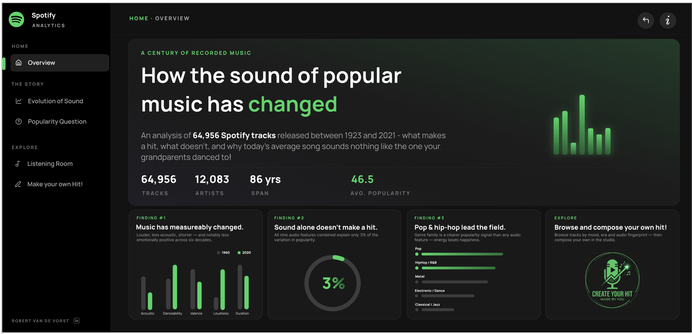
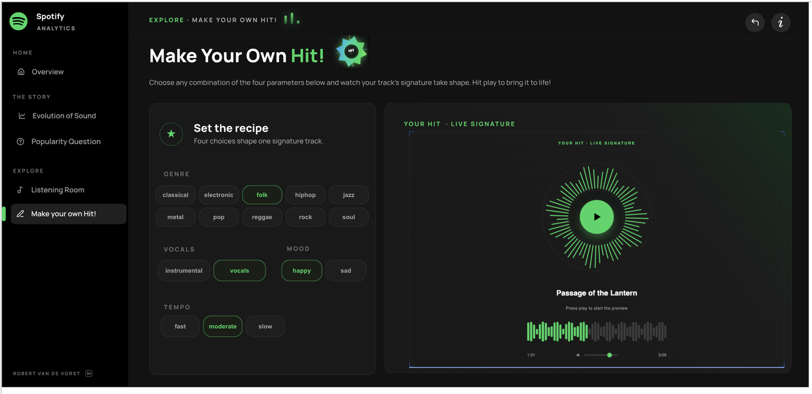

# Spotify Music Analytics

**A guided Power BI report on 64,956 Spotify tracks — 12,083 artists, 1923 to 2021.**

What separates the songs people love from the ones they skip? Instead of a single dashboard, this project is built as a guided experience across several connected pages, combining exploratory analysis with storytelling.


**▶ [View the live report on the Microsoft Fabric Data Stories Gallery](https://community.fabric.microsoft.com/discussions/DataStoriesGallery/spotify-analytics/5296493)**

---

## What's inside

**Overview** — a landing page that surfaces the headline findings up front, with quick-read summary cards so you can see the main takeaways before diving deeper.



**Evolution of Sound** — a chapter-based walkthrough of how the sound of popular music has shifted over the decades, with a narrative rail and supporting charts for each theme.

**Popularity Question** — the analytical core: a "fingerprint" radar comparing the average popular track against the average unpopular one, a simple model view showing which features carry the most predictive weight, per-feature scatter plots, and breakdowns by genre and era.

**Listening Room** — a fully filterable track explorer. Filter by genre, release year and audio-feature ranges.

**Make your own Hit!** — an interactive tool where you set several feature levels to generate your own track. *Note: for public demo purposes the tracks have been pre-generated using the Suno API.*



---

## Key takeaways

**Sound alone doesn't make a hit.** A track's audio features explain only ~3% of its popularity — the rest is fame, marketing, playlists and timing. Adding release year to the model lifts that to just 3.8%.

**Hits and flops sound almost the same.** The audio "fingerprints" of popular and unpopular tracks nearly overlap. Hits are marginally more danceable, slightly louder and far less instrumental, but no audio feature cleanly separates them.

**Music has drifted moodier and more produced.** Over sixty years songs got less acoustic (0.53 → 0.25), more danceable (peaking at 0.68 in the 2020s), louder (roughly +4 dB — the "loudness war"), shorter (down about a full minute since the 1970s) and measurably less cheerful (valence 0.58 → 0.46).

**Loudness is the strongest audio signal (+0.14); instrumentalness is the strongest drag (−0.11).** Every correlation with popularity is weak — but the features correlate strongly with *each other*: energy and loudness move together (+0.75), both move opposite to acousticness.

**Recency wins.** Tracks from the 2010s are the most popular cohort (49.6 average) against 44.1 for pre-1980 releases. Spotify's popularity score follows active listening, so catalogue tracks fade as attention moves to newer music.

**The score is real.** Spotify streams and popularity correlate at +0.51, confirming the score tracks actual listening volume. YouTube views correlate at +0.29 with Spotify popularity and +0.55 with streams — related platforms that still reward somewhat different catalogues.

---

## This repository

This repo holds the pre-generated audio used by the **Make your own Hit!** page of the report.

```
Songs/     MP3 tracks generated with the Suno API, one per feature combination
```

Because a live generation API can't be exposed in a public Power BI report, every combination the page offers was rendered ahead of time. Selecting a set of parameters in the report resolves to the matching file here, which is streamed back into the page's player.

The Power BI file itself and the cleaned dataset are not published here.

---

## Data

Two Kaggle datasets, joined on the unique Spotify track ID:

- [Songs Dataset](https://www.kaggle.com/datasets/jashanjeetsinghhh/songs-dataset) — 64,999 rows × 28 columns. The core catalogue: track metadata plus eight Spotify audio features.
- [Spotify and YouTube](https://www.kaggle.com/datasets/salvatorerastelli/spotify-and-youtube) — 7,473 rows × 45 columns. An enrichment layer for a subset of the catalogue: genre, tempo, musical key and mode, plus YouTube views, likes, comments and Spotify stream counts.

All 7,473 IDs in the second dataset also exist in the first, and 27 of its columns are shared. It is not a separate population of songs — it's extra detail on roughly 11% of the catalogue. A **left join on `spotify_id`** keeps all 64,999 catalogue rows and carries across only the 17 columns unique to the second file.

### Cleaning

Deliberately conservative — fix genuine errors, don't throw away usable rows. 43 rows removed in total (0.1%).

| Step | Action | Records |
|---|---|---|
| Date formats | Parsed to a single ISO datetime | 64,999 |
| Placeholder dates | `01/01/1900` ("unknown") set to blank | 6 |
| Duplicate recordings | Same song across albums removed, most popular kept | 43 removed |
| Duration outliers | Under 30s or over 15min flagged, not deleted | 77 flagged |
| Loudness artefacts | Positive dB values (clipping) capped at 0 | 13 |
| Dead columns | URLs, images, raw description text dropped | 7 columns |

**Final table: 64,956 rows, 99.9% retained.**

### Derived fields

Nine analytical fields were added on top of the raw columns, becoming ready-made slicers and axes in the report:

| Field | Built from |
|---|---|
| `decade` | Release year rounded down (1994 → "1990s") |
| `era` | Five broad periods, Pre-1980 through 2020s |
| `duration_min` | Milliseconds converted to minutes |
| `popularity_tier` | Hit / Popular / Moderate / Niche bands |
| `mood` | Valence × energy quadrant — Happy, Sad, Calm, Tense |
| `genre_group` | 48 sub-genres collapsed into 9 chart-ready families |
| `key_name`, `mode_name` | Numeric key/mode mapped to "C#", "Major" |
| `yt_like_rate` | YouTube likes ÷ views |

Valence and energy are each hard to read alone. Crossing them produces four labels anyone understands, which makes a far better slicer than two abstract 0–1 numbers.

---

## How it's built

The model is intentionally compact: two imported tables (`Tracks`, and a pre-computed correlation matrix `Corr` in long format) plus a dedicated `Measures_` table holding 31 measures. There are no relationships — the two data tables are analysed independently.

Most of the visual richness comes from **DAX measures that generate HTML and SVG**, rendered through an HTML-content custom visual: the correlation heatmap, the hits-vs-niche radar, the decade trend charts, the scatter plots, the audio preview player and the custom filter readouts. Static page chrome is designed as SVG and applied as a page background, with transparent visuals layered on top. A dual-handle range slider was built with the Power BI Visuals SDK to give the Listening Room real numeric filtering on the audio-feature columns.

The trade-off is worth naming: HTML-in-DAX gives precise control over styling but couples the visuals to string-building, so any change means editing measure markup.

---

## Limitations

- The catalogue is a curated sample, not all of Spotify. Trends describe these tracks, not the whole industry.
- Genre and YouTube fields cover only ~11% of tracks — those findings are directional.
- Popularity is a live Spotify metric, reflecting listening at extract time. It will keep shifting toward newer releases.
- Correlation is not causation. Every relationship here is an association.
- Energy and loudness tell nearly the same story; treating them as independent signals would double-count.

---

## Credits

Report design made with the help of Claude, and inspired by the work of PauloGrijo, Gusbavia, nayarahellen and MariusHelle.

**Robert van de Vorst** — [LinkedIn](https://www.linkedin.com/in/robertvandevorst/)
